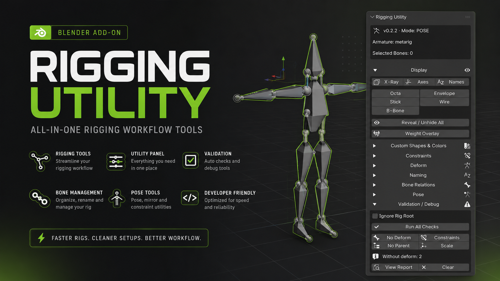

# Rigging Utility Panel

**v0.2.3** · Addon de Blender para **rigging** — panel compacto en el Viewport con operaciones batch sobre huesos seleccionados y herramientas de validación.

| | |
|---|---|
| **Blender** | 5.1+ (probado en 5.1; orientado a API 4.x / 5.x) |
| **Ubicación** | `View3D` → Sidebar (`N`) → pestaña **Rig Tools** |
| **Categoría** | Rigging |

---

## Qué problema resuelve

En rigging se repiten muchas acciones pequeñas: cambiar display, colores, deform, constraints, nombres, revisar errores del rig… y suelen estar repartidas entre modos, menús y propiedades.

**Rigging Utility Panel** concentra esas tareas en un solo shelf: menos clics, secciones plegables y operaciones sobre la **selección actual** de huesos.

---

## Características

### Display

- **In Front**, **Axes**, **Names** (toggle)
- Tipos de visualización: Octahedral, Stick, B-Bone, Envelope, Wire
- **Reveal / Unhide All** (huesos y colecciones visibles)
- **Weight Overlay** — preview de pesos en el viewport (`show_weight`)

### Custom Shapes & Colors

- Pick / aplicar / limpiar **custom shape** en pose bones
- Color con picker de escena:
  - **Edit** — color del hueso en **Edit Armature** (`EditBone.color`)
  - **Pose** — color del hueso en **Pose Mode** (`PoseBone.color`)
  - **Both** — aplica ambos en el modo correspondiente

### Constraints

- **Copy** / **Replace** constraints desde el hueso activo hacia la selección
- **Mute** / **Unmute** en todos los constraints de los huesos seleccionados

### Deform

- **Deform On** / **Deform Off** (Edit o Pose)
- **Select Deform** / **Select Non-Deform**

### Naming

- **Prefix** y **Suffix** con Apply
- **Prefix + Suffix** en un paso (reemplaza sufijos `.L` / `_R` / `-L` etc. y prefijos conocidos `CTRL_`, `DEF_`, `MCH_`, …)
- Atajos rápidos de sufijo: `.L`, `.R`, `_L`, `_R`, `-L`, `-R`

### Bone Relations

- **Clear Parent** en la selección
- **Head Tail Flip**

### Pose

- **Pose** / **Rest** position

### Validation / Debug

- **Run All Checks** y tests rápidos: No Deform, No Parent, Constraints, Scale
- **Ignore Rig Root** — no marca error si hay un solo root; lista configurable de nombres root (`root`, `pelvis`, `hips`, …)
- **Reporte en popup** — lista de huesos con problema; selección individual o por grupo; se cierra sin bloquear el panel
- **View Report** / **Clear** para reabrir o limpiar el último reporte

El panel **siempre muestra** los botones de test; el detalle de huesos va en la ventana flotante.

---

## Atajos de teclado (opcional)

En **Edit → Preferences → Add-ons → Rigging Utility Panel** podés activar o desactivar los atajos por defecto (editables en **Keymap**).

| Atajo | Acción |
|--------|--------|
| `Shift + Ctrl + M` | Mute constraints (selección) |
| `Shift + Ctrl + U` | Unmute constraints (selección) |
| `Shift + Ctrl + R` | Reveal / unhide all bones |

---

## Instalación

### Desde ZIP (recomendado)

1. Generá el ZIP con la **carpeta** del addon dentro (no los `.py` sueltos):

   ```powershell
   Compress-Archive -Path ".\Rigging_Panel" -DestinationPath ".\Rigging_Panel.zip" -Force
   ```

   Estructura correcta dentro del ZIP:

   ```text
   Rigging_Panel.zip
   └── Rigging_Panel/
       ├── __init__.py
       ├── ui.py
       ├── preferences.py
       ├── operators/
       └── utils/
   ```

2. En Blender: **Edit → Preferences → Add-ons → Install…**
3. Elegí `Rigging_Panel.zip`
4. Activá **Rigging Utility Panel**
5. En el viewport 3D, sidebar **`N`** → **Rig Tools**

### Instalación manual

Copiá la carpeta `Rigging_Panel` en:

```text
%APPDATA%\Blender Foundation\Blender\<versión>\scripts\addons\
```

Reiniciá Blender o usá **Reload Scripts** si ya estaba cargado.

### Si no aparece o falla al activar

- Borrá copias viejas en `scripts/addons/Rigging_Panel`
- Reinstalá el ZIP
- Revisá la consola (**Window → Toggle System Console**) por errores de Python
- En el panel debería verse la versión en la cabecera (ej. `v0.2.3`)

---

## Estructura del proyecto

```text
Rigging_Panel/
├── __init__.py              # bl_info y registro del addon
├── ui.py                    # Panel principal (Rig Tools)
├── preferences.py           # Preferencias y keymaps
├── operators/
│   ├── constraints.py
│   ├── deform.py
│   ├── display.py
│   ├── naming.py
│   ├── pose.py
│   ├── relations.py
│   ├── shapes_colors.py
│   └── validation.py
├── utils/
│   ├── bone_selection.py    # Selección compatible Blender 5.x
│   ├── context.py             # Armature, selección, settings de escena
│   ├── validation_data.py
│   └── validation_ui.py       # UI del popup de reporte
└── assets/
    └── images/
        └── thumbnail_rigging_panel.png
```

---

## Requisitos y notas

- Armature activa o seleccionada para la mayoría de operadores
- Varias herramientas requieren **Pose Mode** o **Edit Armature**
- En **Blender 5.x**, la selección de huesos usa `PoseBone.select` / `EditBone.select` (no `Bone.select` en `armature.data.bones`)

---

## Roadmap (ideas)

- Mirror / simetría avanzada de huesos
- Copiar un solo tipo de constraint
- Script `build_zip.ps1` para empaquetar el addon sin errores de estructura

---

## Licencia

Uso libre para estudio y proyectos personales. Ajustá la licencia (MIT, GPL, etc.) antes de publicar si lo necesitás para producción comercial.

---

## Autor

**Kalil Fiat**
